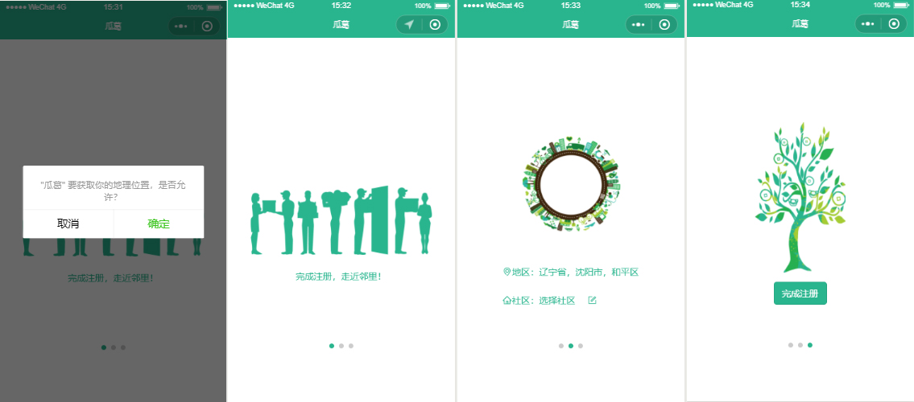
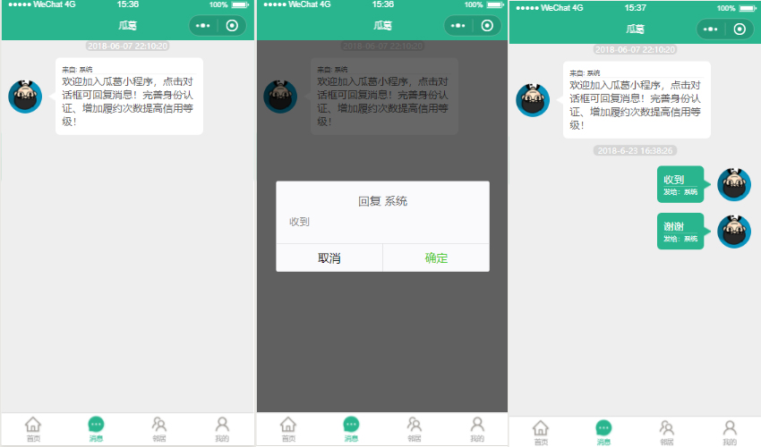
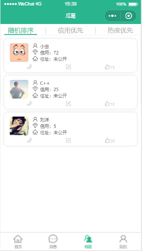
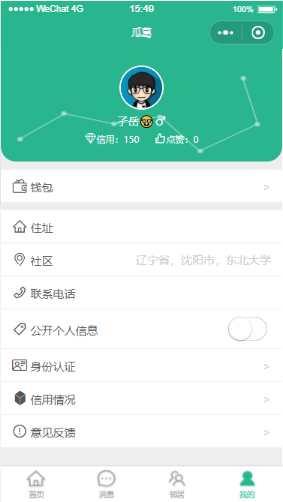
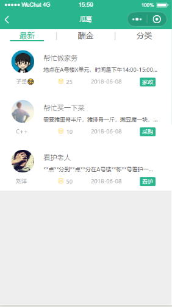
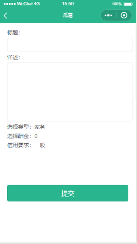
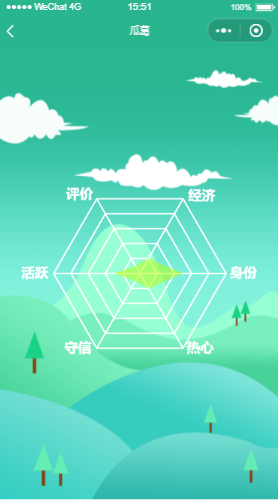

# guage

> 基于微信小程序平台开发的邻里互助系统。最低支持微信小程序版本1.9.1。

## Synopsis
瓜葛小程序面向社区居民提供有偿性的互帮互助功能。

- register

- home page

- message

- neighbor list

- personal page

- request list

- send request

- credit analysis

## Dependent

- Baidu Map Api
    [百度地图 小程序 API](https://lbsyun.baidu.com/index.php?title=wxjsapi)

## usage

1. [下载小程序开发者工具](https://developers.weixin.qq.com/miniprogram/dev/devtools/download.html)
2. 下载项目到本地
3. 用小程序开发者工具打开项目